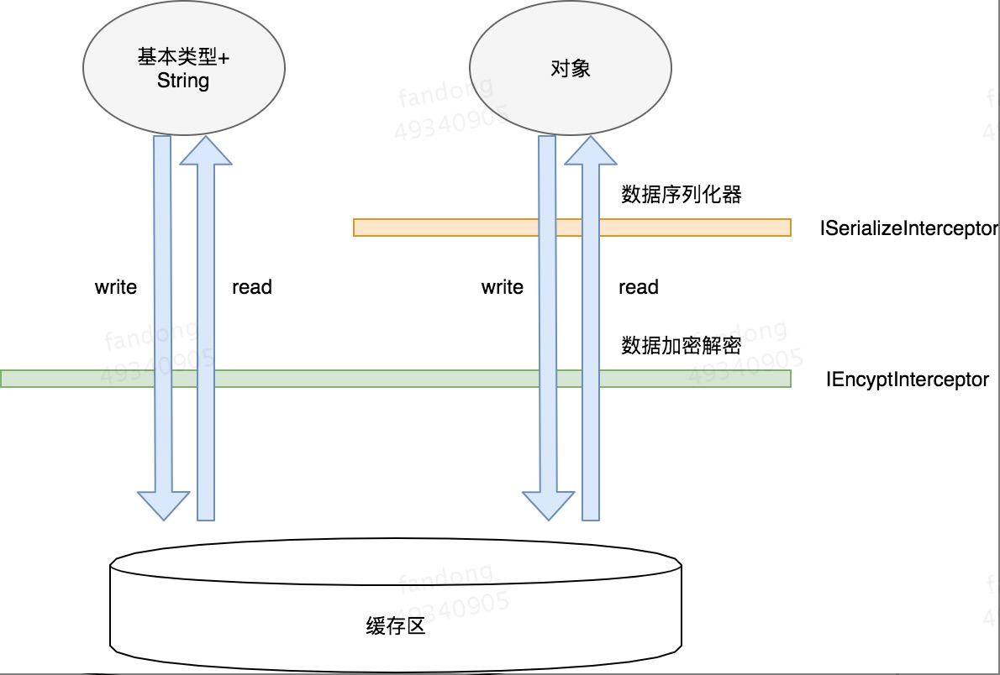
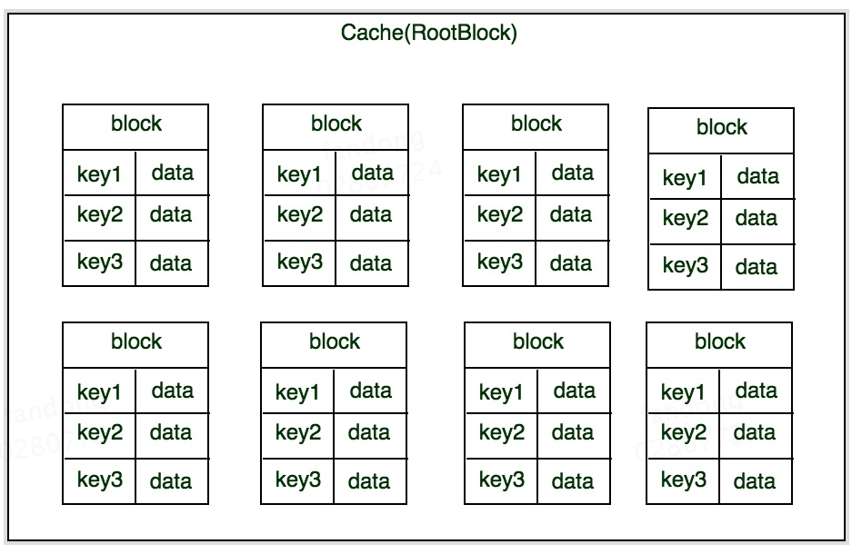
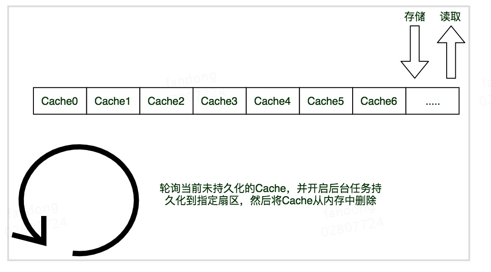

# AndroidBlockCache
高性能安全的数据持久化缓存框架
[](https://jitpack.io/#fandong12388/AndroidBlockCache)
## 一、背景

#### 1、背景介绍

&nbsp;&nbsp;&nbsp;数据持久化缓存是App里面使用非常频繁的功能，目前，android平台的数据持久化常见的操作包括：SharedPreference、数据库和文件存储，SharedPreference 的本质是在设备存储设备上保存一系列的xml文件，以key-value的形式持久化较小数据单元，通常用来保存应用的配置信息，不适合保存较大数据。对于数据库存储，适合结构化的数据存储，在未使用第三方ORM框架的情况下，编写SQLite程序是比较复杂的，并且可能造成SQL注入的漏洞被黑客攻击，同时如果数据库未经加密可能会造成数据泄露，造成安全问题，如果引入第三方ORM的引入会增加学习成本（框架本身和数据库加密），所以在日常的开发工作中，亟需一种适合高频读写、足够简单安全的数据持久化缓存框架，这也是AndroidBlockCache诞生的原因。


#### 2、适用场景

小数据频繁读写的场景（应用配置信息(SharedPreference的所有场景)、网络数据缓存、对象序列化存储、数据库等)

## 二、接入步骤

#### 第一步、gradle引入
```gradle

allprojects {
    repositories {
        maven { url 'https://jitpack.io' }
    }
}

```

```gradle

implementation 'com.block:cache:1.0.0'

```

#### 第二步、初始化

```
    BlockCache.initializer(this)//this:Context
      .debug(BuildConfig.DEBUG)//是否是Debug环境，Debug环境下将输出Debug日志(非必选)
      .encyptInterceptor(new EncyptInterceptor())//数据存储加/解密操作(非必选)
      .serializeInterceptor(new SerializeInterceptor())//数据序列化方式(json、serialize等等)
      .rootBlock("sample")//根扇区
      .defaultBlock("default")//默认扇区
      .initialize();
```

#### 第三步、数据处理
###### 1、数据存储

```java
   /**
     * 存储数据
     *
     * @param block 扇区名称
     * @param key   数据对应的key
     * @param value 数据(支持的数据类型包括byte[]、Boolean、Integer、Long、Object)
     */
   BlockCache.putT(block, key, T value)
```

```java
   /**
     * 存储数据，会将value存入第二步、初始化中的.defaultBlock指定的默认扇区中，如果没有指定，则会存入default扇区
     *
     * @param key   数据对应的key
     * @param value 数据(支持的数据类型包括byte[]、Boolean、Integer、Long、Object)
     */
   BlockCache.putT(key, T value)
```
###### 2、同步获取数据

```java
    /**
     * 同步获取数据
     * @param block 扇区名称
     * @param key 数据key
     * @return 数据(支持的数据类型包括byte[]、Boolean、Integer、Long、Object)
     */
    BlockCache.getT(block, key)
```

```java
    /**
     * 同步获取数据，会从第二步、初始化中的.defaultBlock指定的默认扇区查询数据，如果没有指定，则默认查询default扇区
     * @param key 数据key
     * @return 数据(支持的数据类型包括byte[]、Boolean、Integer、Long、Object)
     */
    BlockCache.getT(key)
```
###### 3、异步获取数据

```java
   /**
     * 异步获取数据
     * @param block 扇区名称
     * @param key 数据key
     * @param listener 异步数据获得监听(支持的数据类型包括byte[]、Boolean、Integer、Long、Object)
     */
    BlockCache.loadT(block, key)//loadT包括loadBoolean、loadObj等等
        .subscribe(value -> xxx());//subscribe会在主线程中执行
```

```java
   /**
     * 异步获取数据，会从第二步、初始化中的.defaultBlock指定的默认扇区查询数据，如果没有指定，则默认查询default扇区
     * @param key 数据key
     * @param listener 异步数据获得监听(支持的数据类型包括byte[]、Boolean、Integer、Long、Object)
     */
    BlockCache.loadT(block, key)//loadT包括loadBoolean、loadObj等等
        .on(value -> xxx());//on会在主线程中执行
```

###### 4、删除数据

```
  BlockCache.remove(String block, String key);

  BlockCache.remove(String block);
  
  BlockCache.clear();
```

###### 5、迭代数据

```
    List<String> BlockCache.getKeys(String block);
```

#### 第四步、混淆

```
    -keep class com.block.cache.BlockCache { *; }
    -keep class com.block.cache.BlockCache* { *; }
    -keep class com.block.cache.interceptor.* { *; }
    -keep class com.block.cache.ICacheListener { *; }
    -keepclassmembers class com.block.cache.internal.task.CacheReadTask {
        public void on(com.block.cache.ICacheListener);
    }
```

## 三、设计分析
#### 1、数据处理过程

#### 


#### 2、存储流程
BlockCache将SDCard的存储区分为多个扇区(block)，在扇区内以文件形式持久化用户数据，文件名即为用户自定义的key，如下图所示：



**设计原理如下**



从图中可以看出，缓存的操作首先是将“存/删”的操作和数据放到一个队列的队尾，然后通过轮询，将未完成的任务从队首取出来，放到线程池中进行持久化存储，读取的时候是同样是从队尾开始读取，读取不到会进一步读取sdcard的缓存结果。

## 四、最佳实践
#### 1、初始化

```
    private void initBlockCache() {
      BlockCache.initializer(this)
        .debug(BuildConfig.DEBUG)
        .encyptInterceptor(new EncyptInterceptor())
        .serializeInterceptor(new SerializeInterceptor())
        .rootBlock("sample")
        .initialize();
    }
```

**EncyptInterceptor.java**


```
    public class EncyptInterceptor implements IEncyptInterceptor {
        @Override
        public byte[] encypt(byte[] buffer) {
            if (null == buffer || buffer.length == 0) {
                return buffer;
            }
            return Base64.encode(buffer, 0, buffer.length, Base64.NO_WRAP);
        }

        @Override
        public byte[] decypt(byte[] buffer) {
            if (null == buffer || buffer.length == 0) {
                return buffer;
            }
            return Base64.decode(buffer, 0, buffer.length, Base64.NO_WRAP);
        }
    }
```

**SerializeInterceptor.java (对象序列化方式为json)**

```
    public class SerializeInterceptor implements ISerializeInterceptor {
        private static final String DEFAULT_CHARSET = "UTF-8";
        private Gson gson;

        public SerializeInterceptor() {
            this.gson = new Gson();
        }

        @Override
        public byte[] serialize(Object object) {
            try {
                if (null == object) {
                    return null;
                }
                String content;
                if (TextUtils.isEmpty(content = gson.toJson(object))) {
                    return null;
                }
                return content.getBytes(DEFAULT_CHARSET);
            } catch (UnsupportedEncodingException ignore) {
            }
            return null;
        }

        @Override
        public <T> T deSerialize(byte[] buffer, Class<T> clazz) {
            if (null != buffer && null != clazz) {
                try {
                    return gson.fromJson(new String(buffer, DEFAULT_CHARSET), clazz);
                } catch (UnsupportedEncodingException ignore) {
                }
            }
            return null;
        }
    }
```

#### 2、数据保存

```
    public void saveObj(View view) {
        BlockCache.putObj("teacher", "techer_1", getDefaultObject());
    }
```

#### 3、数据异步读取

```
    public void getObj(View view) {
        BlockCache.loadObj("teacher", "techer_1", Teacher.class)
                .on(teacher -> {
                    if (null != teacher) {
                        textView.setText(teacher.toString());
                    } else {
                        textView.setText("获取为空");
                    }
                });
    }
```

## 五、总结
&nbsp;&nbsp;&nbsp;BlockCache采用完全的java设计，并无引入第三方库，兼容 android sdk 8以上的版本，灵活性高。

**Copyright and License**

[Apache 2.0 License](./LICENSE)


